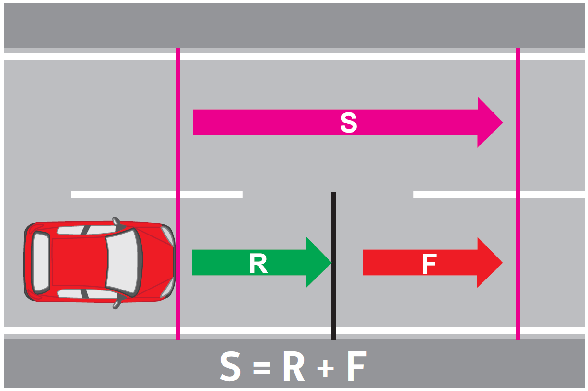
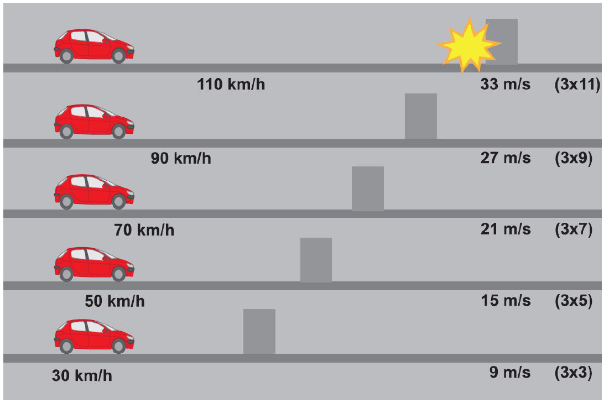
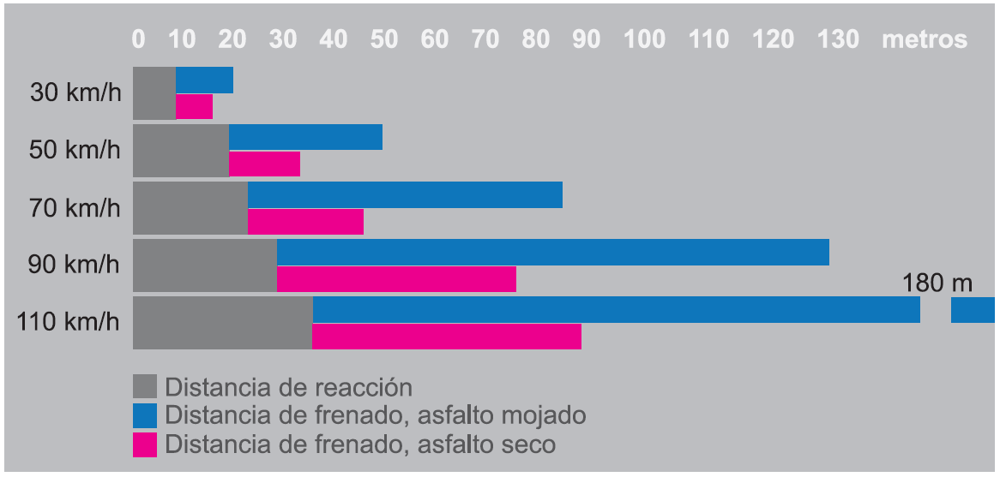

# La distancia de detención

La distancia para detenerse \(S\) consta de dos partes:

* Distancia de reacción \(R\)
* Distancia de frenado \(F\)

La longitud de la distancia de reacción depende del tiempo de reacción del conductor y de la velocidad del vehículo. Un tiempo normal de reacción es un segundo. Un vehículo que circula a 36 kilómetros por hora recorre 10 metros en un segundo, 20 metros si lo hace a 72 kilómetros por hora, etcétera.

Los principiantes, debido a su falta de experiencia suelen dudar, teniendo, en consecuencia, mayores distancias de reacción.

Usted puede estimar aproximadamente la distancia de reacción, multiplicando por tres la primera cifra de la velocidad.

La longitud de la distancia de frenado depende de la velocidad, del estado de la carretera, de la pendiente, del estado de los frenos y neumáticos, y de la forma de frenar.

La distancia de frenado crece con el cuadrado del aumento de la velocidad. Así, **si usted duplica la velocidad, la distancia de frenado aumenta cuatro veces; si la triplica, la distancia de frenado aumenta 9 veces**, etcétera.

En cuanto a la forma de frenar, hay varias maneras. El conductor que planifica su conducción disminuyendo a tiempo la presión sobre el acelerador y reduciendo su velocidad, ahorra frenos y aumenta su seguridad.

En situaciones inesperadas es necesario saber frenar correctamente. Ya se ha señalado que **las ruedas atascadas impiden guiar el vehículo**. Por ello, al comenzar a frenar se debe presionar el freno con la mayor fuerza posible. Si el vehículo no cuenta con frenos ABS y se bloquean las ruedas, hay que reducir en seguida la presión sobre el pedal de freno soltándolo.

