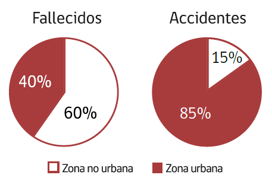

# Estadísticas de accidentes en Chile

Anualmente en Chile se registran más de 86.000 accidentes. Como consecuencia de éstos fallecen aproximadamente 1.600 personas , lo que significa que diariamente mueren entre 4 y 5 personas en las vías públicas. En promedio 550 de ellas son atropelladas.

* La probabilidad de que un peatón muera atropellado se multiplica por ocho cuando la velocidad del vehículo sube de 30 a 50 kilómetros por hora.
* Los peatones tienen 90% de posibilidades de sobrevivir a impactos a 30 kilómetros por hora o menos, pero menos del 50% de probabilidades de sobrevivir a un choque a 45 kilómetros por hora o más.
* Esto significa que a una velocidad de 65 kilómetros por hora lo más probable es que un peatón atropellado muera.

Además, como promedio de los últimos 5 años, aproximadamente 8.000 personas resultaron lesionadas graves en los más de 86.000 accidentes.

**La mayor parte de los fallecidos** por accidentes de tránsito se produce en **vías interurbanas** o no urbanas.

Si bien la mayor cantidad de muertos en accidentes de tránsito se registra en carreteras y autopistas fuera de áreas urbanas, la mayor cantidad de accidentes – aproximadamente un 85% - se produce en vías o áreas urbanas; de éstos, la mayoría se registra en los cruces de calles o intersecciones. Sólo un 15% de los accidentes se produce en zonas no urbanas \(rural\).

También en **vías urbanas** se produce la **mayor cantidad de lesionados**, sobre 40.000 en promedio al año, sin embargo éstos en su mayoría son de menor gravedad que los lesionados en carreteras.

Los períodos de mayor accidentabilidad coinciden con feriados largos. Los días más peligrosos son fines de semana \(normales o largos\), las horas más peligrosas son las de la noche y las de la madrugada y, en general coinciden con situaciones de escaso flujo vehicular.

El grupo etario de mayor accidentabilidad son los jóvenes, entre 18 y 29 años. Éstos representan aproximadamente el 27% del total de conductores fallecidos en accidentes de tránsito en los últimos años.

| Rango de edad | Porcentaje de conductores fallecidos |
| :--- | :--- |
| 0-17 | 2% |
| 18-29 | 27% |
| 30-39 | 20% |
| 40-49 | 18% |
| 50-59 | 16% |
| 60 o más | 16% |
| No se informa | 1% |


Estas cifras están basadas en las estadísticas de Carabineros de Chile, quienes contabilizan los fallecidos sólo dentro de las 24 horas de producido el accidente.


Finalmente, se debe agregar que cerca del 92% de los conductores fallecidos en accidentes de tránsito son varones y que la falla humana está presente en más del 90% de los accidentes. El consumo de alcohol al conducir y la desobediencia a las señales del tránsito son unos de los factores de mayor incidencia en la ocurrencia de accidentes de tránsito.

